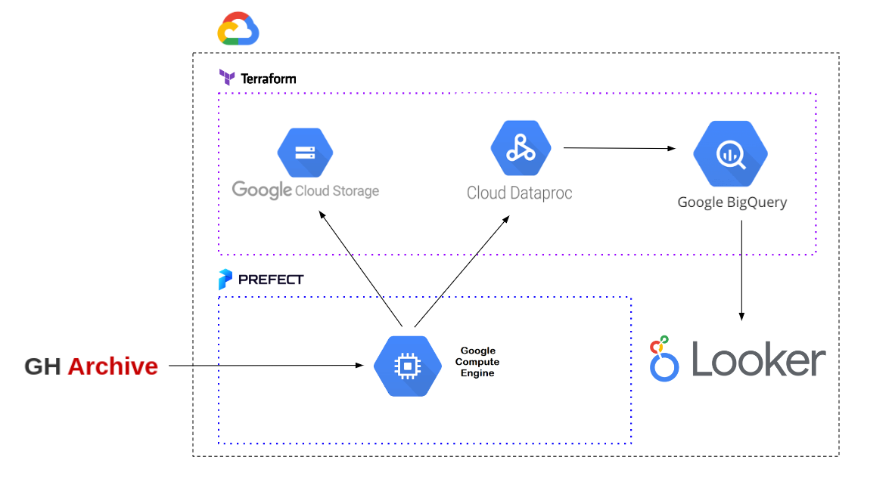
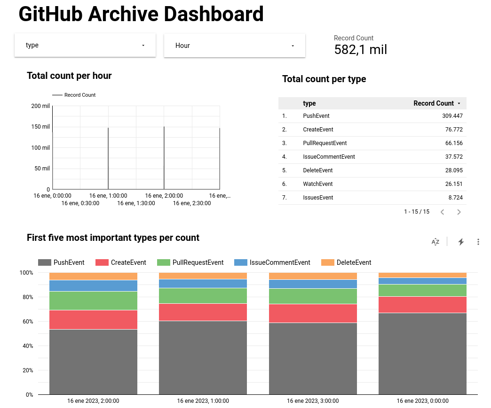

# de-github-user
Code repository for DEZC project

## Overview
The goal of this project is to build an end-to-end pipeline that extracts data, loads it in a data lake, to be later transformed with a big data tool to finally be consumed by a data visualization layer. For this purspose, the tools to be used are:
- GCP: as a cloud provider
- Terraform: for setting up the infrastructure
- Prefect: for the ELT orchestration
- Pyspark: for transformation
- BigQuery: as a Data Warehouse
- Looker: for data visualization



## Data source
We are going to use the [GitHub Archive](https://www.gharchive.org/) data source. This provides:

*20+ event types, which range from new commits and fork events, to opening new tickets, commenting, and adding members to a project. These events are aggregated into hourly archives*

## Problem description
The user need to have a clear picture of what are the trendiest GitHub repositories and who are the GitHub users most active in the past day.

## Steps to run the pipeline

- First, in a local or virtual machine install python, Google Cloud SDK (in case of using a Google VM, it is already provided with the SDK) and Terraform. Install the requirements:

```bash
pip install -r requirements.txt
```

- Next, create a project in GCP. Create a service account and add the following permissions to it: Storage Admin, Storage Object Admin, Big Query Admin, Dataproc Admin. Create also a key and download it to your local. Export the path of the keys to a variable called GOOGLE_APPLICATION_CREDENTIALS.

```bash
export GOOGLE_APPLICATION_CREDENTIALS="$HOME/path"
```

- Authenticate the local machine to the Google Cloud account

```bash
gcloud auth activate-service-account --key-file $GOOGLE_APPLICATION_CREDENTIALS
```

- Clone this repo into your local/virtual machine. From the terraform folder, update the `variables.tf` file with the correct information and run the following commands:

```bash
terraform init
terraform plan 
terraform apply
```

Three resources will be created: a storage bucket, a BigQuery dataset, and a Dataproc cluster (single node, so it is the cheapest one)

> Remember to stop/delete the cluster when you finish running this project.

- In the `src/` folder, update the `config.yaml` file. Copy the `transformation_spark.py` file into the bucket to a folder called code

```bash
gsutil cp transformation_spark.py gs://your-bucket-name/code/transformation_spark.py
```

- Start the Prefect Orion

```bash
prefect start orion
```

And create two blocks: one for `GCP Credentials` and another for `GCS Bucket`. This latter should be named `de-project-bucket`.

- Then we are ready to go. From the `src/` folder run:

```
python ingest.py
```

24 files (one for each hour of the day) will be downloaded to local folder (`data/`), unzipped, transformed to parquet and loaded to the google cloud bucket.

The run:
```bash
python run_spark_job.py
```

This code will submit a job to the Dataproc cluster. It will read the data from the bucket, make some transformations, and loaded it to BigQuery.

- Finally, we can have a look at the Looker dashboard feeded with this data from BigQuery. Follow this [link](https://lookerstudio.google.com/reporting/72f3155c-aab3-48bb-9018-4143560836a0) for the dashboard.



